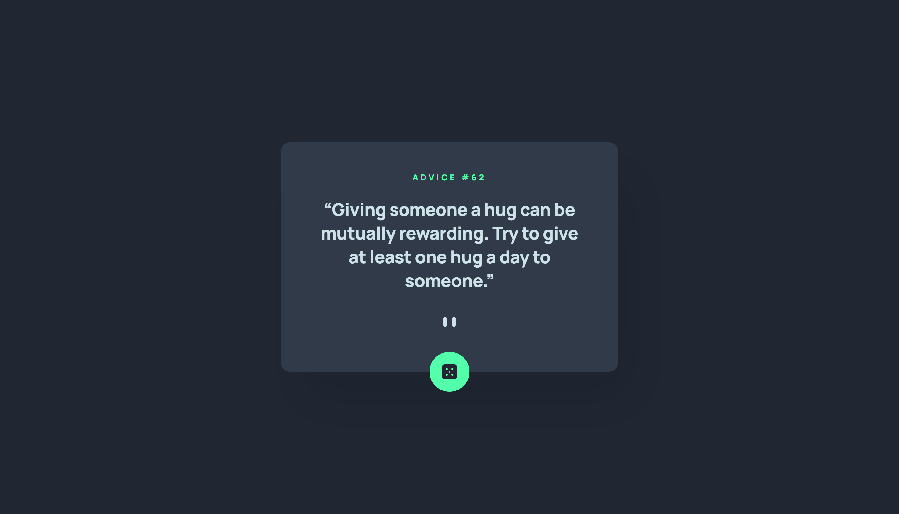

# Frontend Mentor - Advice generator app solution

This is a solution to the [Advice generator app challenge on Frontend Mentor](https://www.frontendmentor.io/challenges/advice-generator-app-QdUG-13db). Frontend Mentor challenges help you improve your coding skills by building realistic projects.

## Table of contents

-   [Overview](#overview)
    -   [The challenge](#the-challenge)
    -   [Screenshot](#screenshot)
    -   [Links](#links)
-   [My process](#my-process)
    -   [Built with](#built-with)
    -   [Useful resources](#useful-resources)
-   [Author](#author)

**Note: Delete this note and update the table of contents based on what sections you keep.**

## Overview

### The challenge

Users should be able to:

-   View the optimal layout for the app depending on their device's screen size
-   See hover states for all interactive elements on the page
-   Generate a new piece of advice by clicking the dice icon

### Screenshot

### Links

-   Solution URL: [https://github.com/Arsalan2078/advice-generator-app.git](https://github.com/Arsalan2078/advice-generator-app.git)
-   Live Site URL: [https://venerable-meringue-49cf96.netlify.app/](https://venerable-meringue-49cf96.netlify.app/)

## My process

### Built with

-   Semantic HTML5 markup
-   CSS custom properties
-   Flexbox
-   CSS Grid
-   Mobile-first workflow
-   Vite
-   React
-   SCSS

### Useful resources

-   [https://utopia.fyi/clamp/calculator/](https://utopia.fyi/clamp/calculator/) - Convenient for generating clamps for css.
-   [https://github.com/elad2412/the-new-css-reset/blob/main/css/reset.css](https://github.com/elad2412/the-new-css-reset/blob/main/css/reset.css) - Comprehensive CSS Reset.
-   [https://gwfh.mranftl.com/fonts](https://gwfh.mranftl.com/fonts) - Helps with fonts.

## Author

-   Frontend Mentor - [@Arsalan2078](https://www.frontendmentor.io/profile/Arsalan2078)
